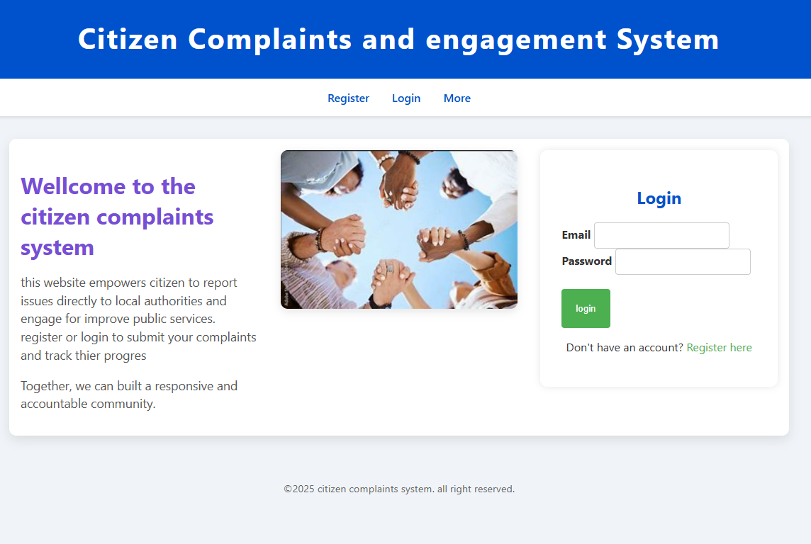
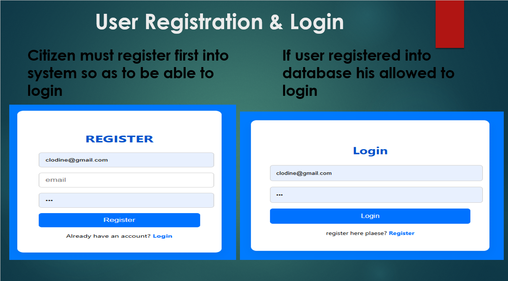
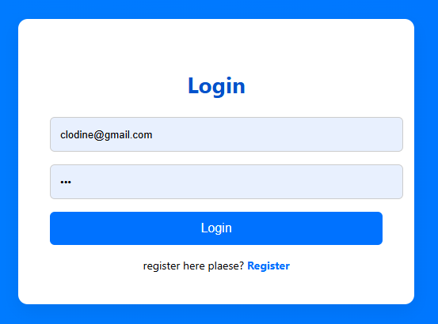
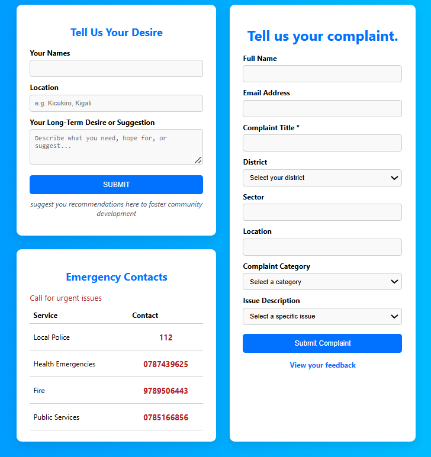
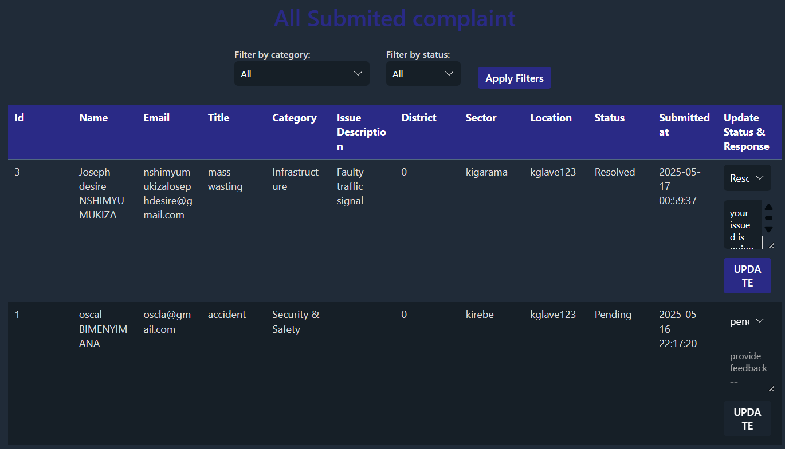
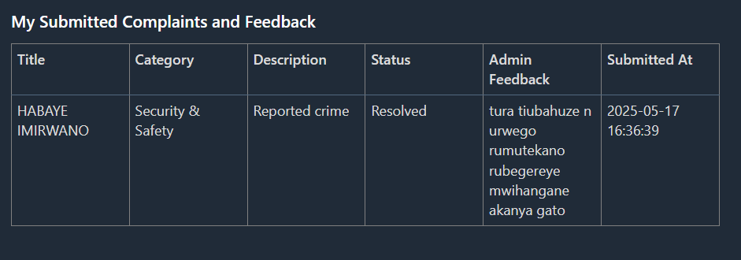

# Citizen Complaints System

##  Introduction

**The Citizen Complaints System** is a web platform designed to bridge the communication gap between government authorities and citizens. It enables citizens to submit complaints, express ideas, and report urgent issues in a structured and organized manner.

## Purpose

The main purpose of this system is to provide citizens with a simple, accessible, and effective way to submit their complaints, report issues, and share suggestions. At the same time, it equips authorities with tools to manage, review, and respond to these concerns efficiently and transparently.

## Functional Requirements

### For Citizens:
- Register and log in to the system.
- Submit complaints, specify desires, and make emergency calls.
- Track the status of submissions and view responses.
- Log out securely.

### For Admin / Authorities:
- View complaints submitted by citizens.
- Update complaint statuses.
- Generate and provide responses.
- Log out securely.

### 1.projects main landing page:

*main landing page where user may interact with the system*

## Technologies Used
- **Frontend**: HTML, CSS, JavaScript
- **Backend**: PHP
- **Database**: MySQL
- **Server**: EasyPHP Devserver

## Benefits

### For Citizens:
- Easy and convenient way to address problems.
- Faster feedback and communication.
- Enhanced collaboration with government authorities.

### For Admin / Authorities:
- Efficient management of citizen issues at scale.
- Better understanding of citizen concerns.
- Easier tracking and oversight of government activities nationwide.

## How It Works
Users first register an account and log in to access the system's features. The system collects data from citizens and organizes complaints for easy review by authorities. This structured data helps the government respond effectively to the population’s needs.

### 1. User Registration Page

*citizen must register first into system so as to be able to login
*
### 3. Login

*if user are already registerd into database his allowed to login.*
### 3. citizens Dashboard

*fill out the forms according to type of availabel question.*

### 3. Admin Dashboard

*Admins view complaints and update statuses with responses.*

### 4. Complaint Status Tracking and feedback 

*Citizens track their complaint progress and view admin feedback.*
## System Requirements

- Windows PC
- Latest version of [EasyPHP Devserver](https://www.easyphp.org/save-easyphp-devserver-latest.php)
- Web browser (Chrome, Firefox, etc.)

---

## How to Run This Project

### Step 1: Download EasyPHP

Install EasyPHP Devserver from the official link:  
[Download EasyPHP Devserver](https://www.easyphp.org/save-easyphp-devserver-latest.php)
### Step 3: Start EasyPHP Services

- Launch EasyPHP Devserver
- Start the **HTTP Server** and **MySQL Server**

---

### Step 4: Create the Database

1. Go to **EasyPHP Dashboard**
2. Open **phpMyAdmin**

## Acknowledgements
This project was developed through extensive self-learning and referencing publicly available programming documentation and tutorials on PHP, MySQL, and web development.
## References

- [W3Schools: PHP MySQL Tutorial](https://www.w3schools.com/php/php_mysql_intro.asp)  
  Covers PHP integration with MySQL — useful for connecting databases, writing queries, and handling form submissions.

- [phpMyAdmin Documentation](https://docs.phpmyadmin.net/)  
  Guides on how to manage MySQL databases visually — including creating tables, importing `.sql` files, and setting up relationships.

- [MySQL JOIN Multiple Tables – MySQL Tutorial](https://www.mysqltutorial.org/mysql-join/)  
  Offers a deep explanation of how to use `INNER JOIN`, `LEFT JOIN`, and join **multiple tables** in a single SQL query. This helped structure queries that combine data from `users`, `complaints`, and `categories` in your system.

